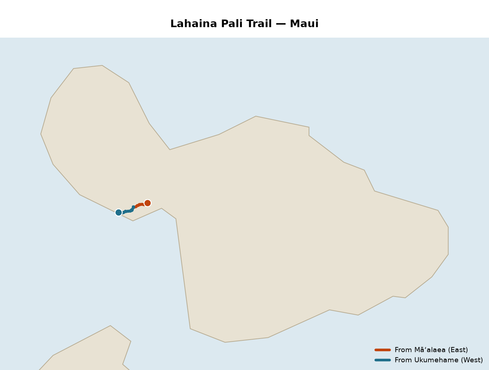
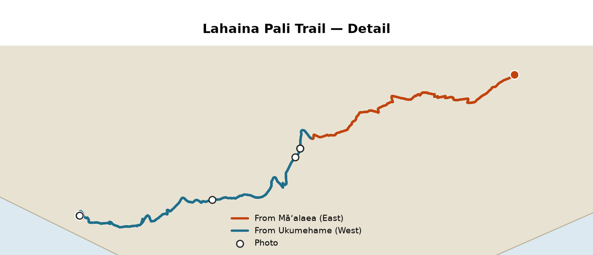


{{ $runs := .Page.Params.runs }}
{{ $miles := 0.0 }}{{ range $runs }}{{ $miles = add $miles .miles }}{{ end }}

Lahaina Pali Trail (Maui): <strong>complete</strong> — {{ len $runs }} runs, {{ $miles | lang.FormatNumber 1 }} mi, one from each trailhead, meeting near the mid-trail high point.



<!--more-->



<h2>Lahaina Pali Trail</h2>

The <a href="https://dlnr.hawaii.gov/dtoh/trails/na-ala-hele/">Nā Ala Hele</a> Lahaina Pali Trail crosses the West Maui Mountains between Māʻalaea and Ukumehame, {{ .Page.Params.trail.length_mi }} mi one-way with about {{ .Page.Params.trail.elev_gain_ft | lang.FormatNumber 0 }} ft of gain and {{ .Page.Params.trail.elev_loss_ft | lang.FormatNumber 0 }} ft of loss between trailheads, both near sea level. Ran as two out-and-back trips, one from each end, meeting near the same mid-trail high point — in aggregate, every mile of the trail covered.

<table>
  <tr><th>Trailhead</th><th>Access</th></tr>
  {{ range .Page.Params.trail.trailheads }}
  <tr>
    <td>{{ .name }}</td>
    <td>{{ .address }}</td>
  </tr>
  {{ end }}
</table>

{{ $runs := .Page.Params.runs }}
{{ $totalMiles := 0.0 }}{{ range $runs }}{{ $totalMiles = add $totalMiles .miles }}{{ end }}
{{ $totalGain := 0 }}{{ range $runs }}{{ $totalGain = add $totalGain .elev_gain_ft }}{{ end }}
{{ $totalCal := 0 }}{{ range $runs }}{{ $totalCal = add $totalCal .calories }}{{ end }}

<h3>Combined</h3>
<table>
  <tr><th>Runs</th><th>Miles</th><th>Elev Gain</th><th>Calories</th></tr>
  <tr>
    <td>{{ len $runs }}</td>
    <td>{{ $totalMiles | lang.FormatNumber 2 }}</td>
    <td>{{ $totalGain | lang.FormatNumber 0 }} ft</td>
    <td>{{ $totalCal | lang.FormatNumber 0 }}</td>
  </tr>
</table>

{{ range $runs }}
<h3>{{ .name }} — {{ .date }}</h3>

<table>
  <tr>
    <th>Miles</th><th>Time</th><th>Avg Pace</th><th>Elev Gain</th><th>Elev Loss</th>
    <th>Elev Range</th><th>Avg HR</th><th>Max HR</th><th>Calories</th>
  </tr>
  <tr>
    <td>{{ .miles }}</td>
    <td>{{ .duration }}</td>
    <td>{{ .avg_pace }}</td>
    <td>{{ .elev_gain_ft | lang.FormatNumber 0 }} ft</td>
    <td>{{ .elev_loss_ft | lang.FormatNumber 0 }} ft</td>
    <td>{{ .elev_min_ft | lang.FormatNumber 0 }}&ndash;{{ .elev_max_ft | lang.FormatNumber 0 }} ft</td>
    <td>{{ .avg_hr }} bpm</td>
    <td>{{ .max_hr }} bpm</td>
    <td>{{ .calories }}</td>
  </tr>
</table>

Splits — <a href="https://connect.garmin.com/modern/activity/{{ .garmin_id }}">Garmin activity {{ .garmin_id }}</a>{{ with .notes }}. {{ . }}{{ end }}

<table>
  <tr><th>Mile</th><th>Distance</th><th>Time</th><th>Pace</th><th>Avg HR</th><th>Max HR</th><th>Calories</th></tr>
  {{ range .laps }}
  <tr>
    <td>{{ .mile }}</td>
    <td>{{ .distance_mi }} mi</td>
    <td>{{ .time }}</td>
    <td>{{ .pace | default "—" }}</td>
    <td>{{ .avg_hr }} bpm</td>
    <td>{{ .max_hr }} bpm</td>
    <td>{{ .calories }}</td>
  </tr>
  {{ end }}
</table>
{{ end }}

{{ with .Page.Params.photos }}
<h2>Photos</h2>
{{ $lastDate := "" }}
{{ range $i, $p := . }}
  {{ $date := slicestr $p.taken_at 0 10 }}
  {{ if ne $date $lastDate }}
    {{ if gt $i 0 }}
{{ end }}
    {{ $run := index (where $runs "date" $date) 0 }}
    <h3>{{ dateFormat "Monday, January 2, 2006" $p.taken_at }}{{ with $run }} &mdash; {{ .name }}{{ end }}</h3>
    

    {{ $lastDate = $date }}
  {{ end }}
  <figure style="width:280px;margin:0;">
    
    <figcaption style="font-size:0.85em;margin-top:4px;">
      {{ $p.caption }} 
      mile {{ $p.mile }} &middot; {{ $p.elev_ft | lang.FormatNumber 0 }} ft &middot; {{ dateFormat "3:04 PM" $p.taken_at }}
    </figcaption>
  </figure>
{{ end }}

{{ end }}


